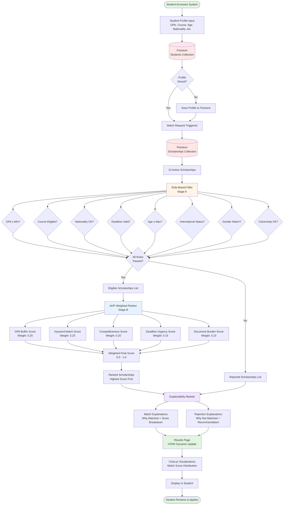
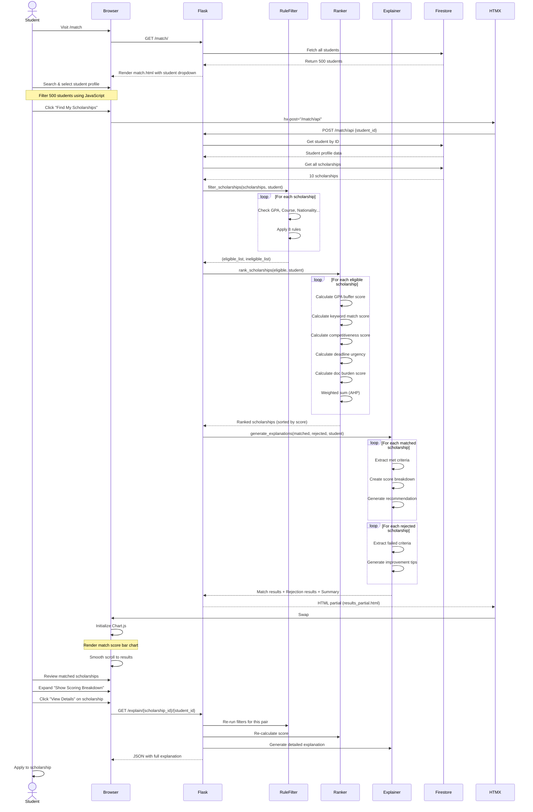
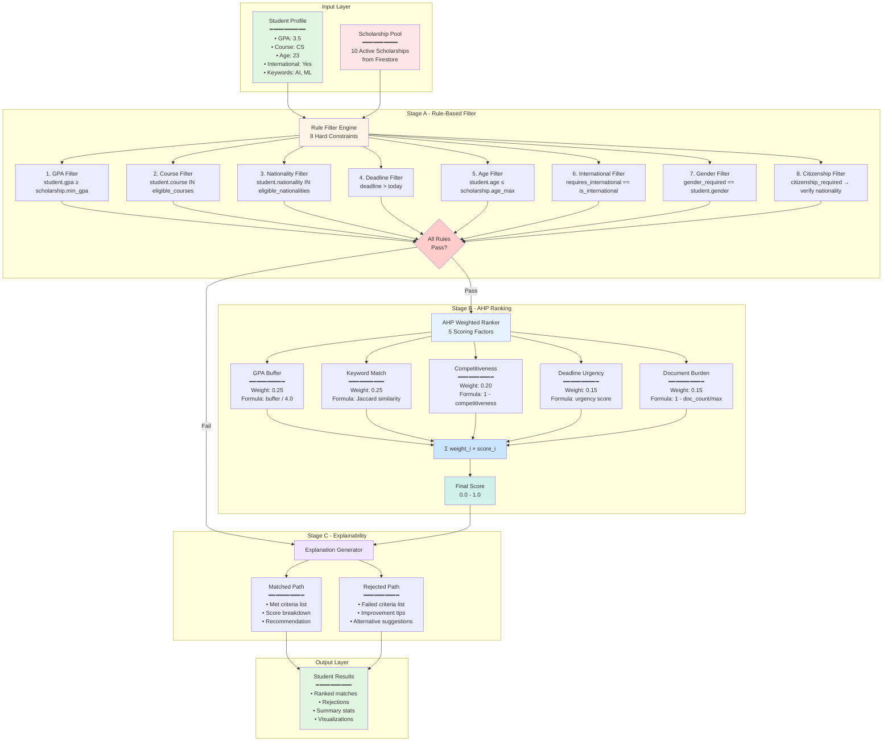
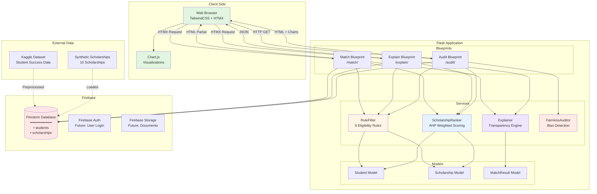
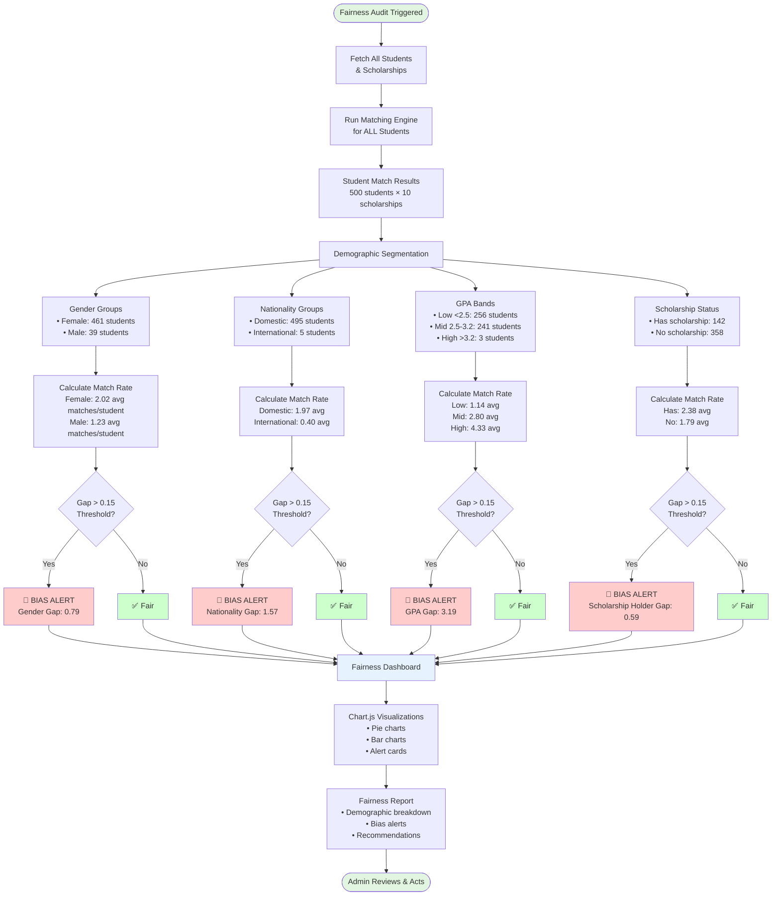
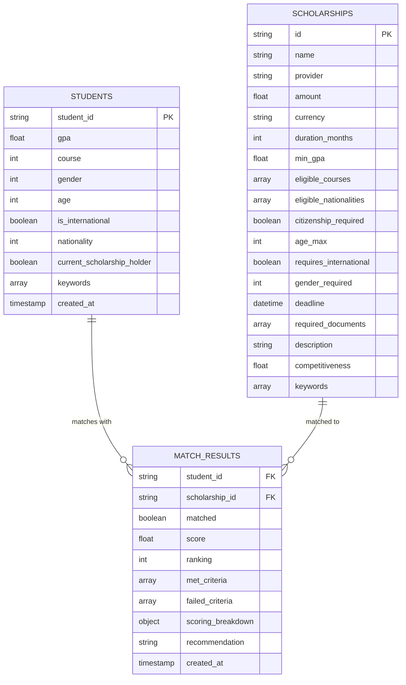

# System Architecture Diagrams

This document contains all system diagrams for the Scholarship Matching DSS project.
You can copy these diagrams to your report or convert them to PNG/PDF.

## How to Convert to PNG

### Method 1: Online (Easiest)
1. Go to https://mermaid.live/
2. Copy the Mermaid code below
3. Paste into the editor
4. Click "Download PNG" or "Download SVG"

### Method 2: VS Code
1. Install "Markdown Preview Mermaid Support" extension
2. Open this file in VS Code
3. Press Cmd+Shift+V to preview
4. Right-click diagram → "Copy as Image"

### Method 3: CLI
```bash
npm install -g @mermaid-js/mermaid-cli
mmdc -i docs/SYSTEM_DIAGRAMS.md -o docs/diagrams/
```

---

## 1. Data Flow Diagram

**Description:** Shows how data flows through the system from student input to final recommendations.



---

## 2. User Interaction Flow

**Description:** Step-by-step user journey through the system.



---

## 3. Decision Logic Architecture

**Description:** Hierarchical view of the DSS decision-making components.



---

## 4. System Architecture Overview

**Description:** High-level architecture showing all components and their interactions.



---

## 5. Fairness Audit Process Flow

**Description:** How the fairness auditing system detects bias.



---

## 6. Database Schema (Firestore Collections)

**Description:** Firestore collections and document structure.



---

## Notes

- All diagrams are in Mermaid format (Markdown-compatible)
- Can be rendered in GitHub, GitLab, VS Code, and online tools
- Easy to edit and version control
- Export to PNG/SVG for reports using mermaid.live or VS Code

---

**Created:** 2026-01-10
**For:** Scholarship Matching DSS - UE Course Project
**Professor:** George
